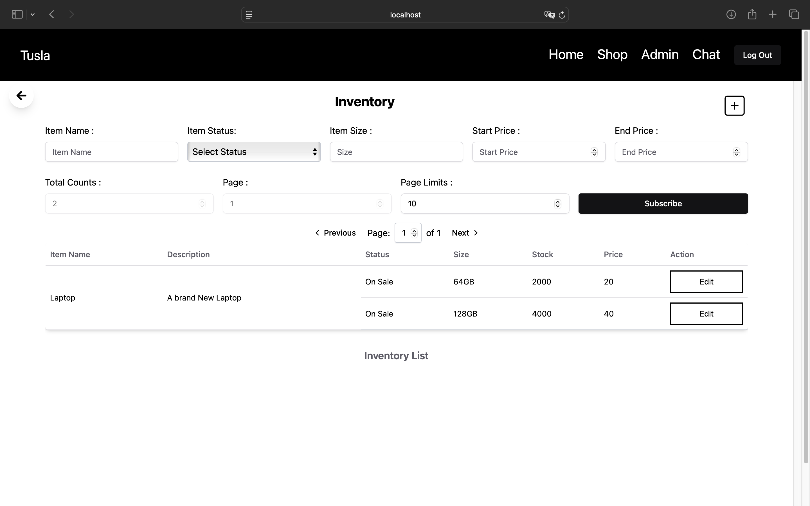
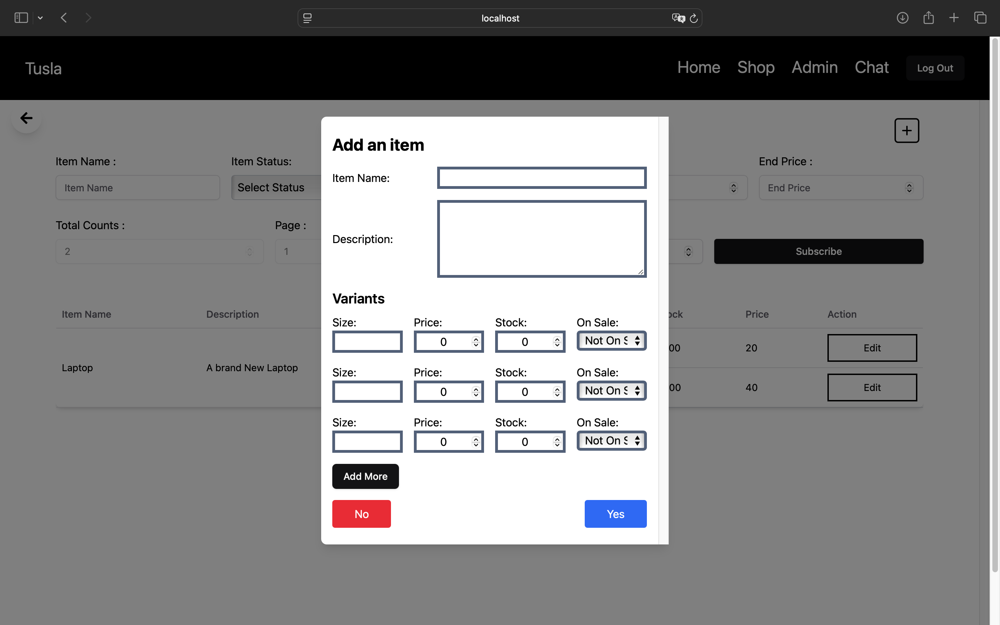
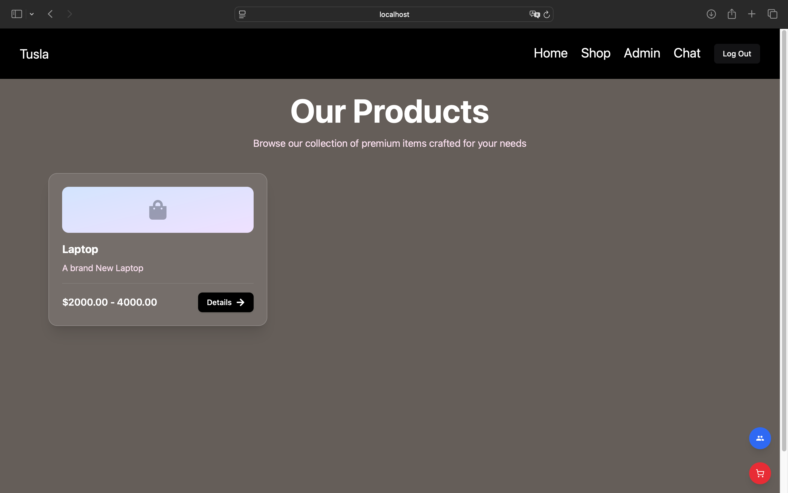
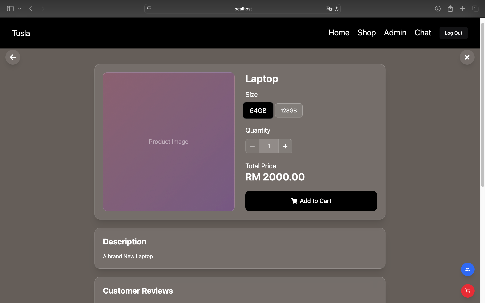
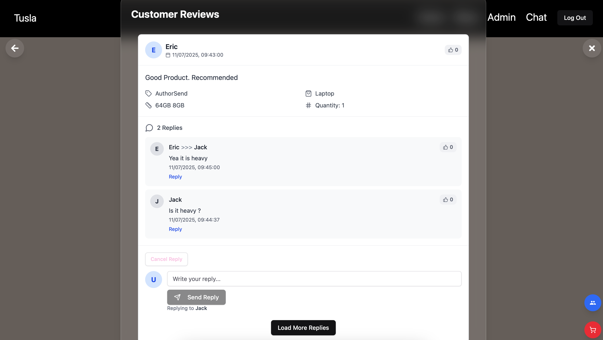
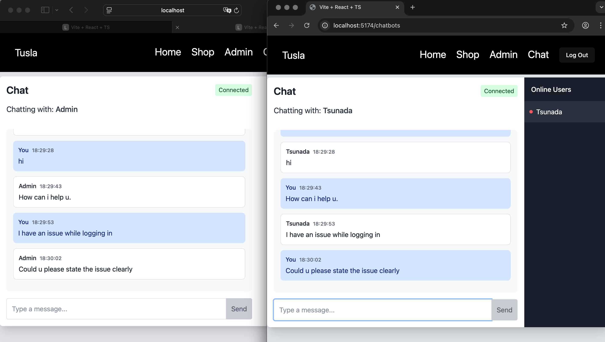

#  E-Commerce Web Based Application

## About This Project

This is a personal project developed as part of my learning. Some features are simplified or intentionally skipped for demonstration purposes: 

- **Admin CRUD are skipped.**
- **Product images are skipped.**
- **Admin routes can be accessed by customers for demo purposes.**

**Role-based access can be verified via the /auth/me endpoint (role === `admin`), which returns the authenticated user object. **

This project consists of:

- **Client** (React)
- **Spring Boot Backend Server**
- **Redis**
- **MySQL**
---

## ✨ Features
- **User Authentication** (Sign in/up and log out)
- **View Available products**
- **Cart Management** (Manage the products that are added into the cart)
- **Order Placement & History**
- **Product Review System**
- **Live chat customer service**
---

## 🛠️ Prerequisites

Make sure the following are installed on your system:

- Node.js & npm
- Java 17+
- Maven
- Docker
- Manually adding products is required. Navigate to Admin and add item
---
## Live Chat Implementation

1. After registration, change the user role to “admin” in MySQL database.
2. Use another client in a different browser to enter the live chat as an admin.

## Project Screenshot
1. Admin Management Page


2. Admin Add Product Page


3. Product List Page


4. Product Page


5. Product Review Page


6. Live Chat Page

   

## ⚙️ Example `application.yml` for Spring Boot

1. Add application.yml in server/logis-app/src/main/resources, Update the datasource password.
```bash
spring:
    application:
        name: logis_app

    datasource:
        url: jdbc:mysql://db:3306/logis
        username: root
        password: ADD_YOUR_PASSWORD
        driver-class-name: com.mysql.cj.jdbc.Driver

    redis:
        host: ${SPRING_REDIS_HOST:localhost}
        port: 6379

mybatis:
    configuration:
        log-impl: org.apache.ibatis.logging.stdout.StdOutImpl 
        map-underscore-to-camel-case: true

logging:
  level:
    com.zaxxer.hikari: DEBUG
    org.springframework.jdbc: DEBUG    
```


2. Update the db/environment same with the application.yml if using docker in docker-compose.yml.
    ```bash
        server:
         environment:
            SPRING_DATASOURCE_URL: jdbc:mysql://db:3306/logis
            SPRING_DATASOURCE_USERNAME: root
            SPRING_DATASOURCE_PASSWORD: ADD_YOUR_PASSSWORD

        db:
         environment:
            MYSQL_ROOT_PASSWORD: ADD_YOUR_PASSWORD
            MYSQL_DATABASE: logis
    ```

## 🔌 Option 1 : Running with docker 

1.  In the logis folder, run the command :
    ```bash
    docker compose down -v // if wanted to delete cache data.
    docker compose build
    docker compose up
    ```

## 📱 Option 2 : Running the Application without docker

1. Navigate to the client/logis-app directory:

   ```bash
   cd client
   cd logis-app
   ```

2. Install dependencies:

   ```bash
   npm install
   ```

3. Navigate to axios instance and change the baseURL to the backend API.

   ```bash
   baseURL = `url`
   ```

4. Run the app on your client application:

   ```bash
   npm run dev
   ```

---

## ☕ Running the Spring Boot Server

1. Navigate to the server directory:

   ```bash
   cd server/logis-app
   ```

3. Run the server using Maven:

   ```bash
   mvn spring-boot:run
   ```

---

## Running the Redis Server in port 6379

1. Paste the command in docker terminal.
    ```bash
    docker run -d --name redis-server -p 6379:6379 redis
    ```

## Create table in MySQL
1.  Paste the file in db-init in directory into MySQL.


